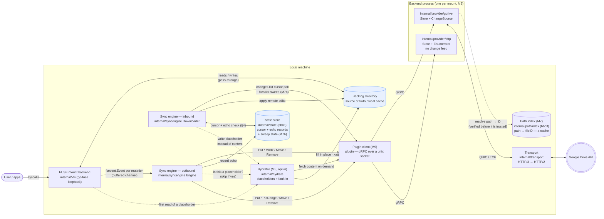
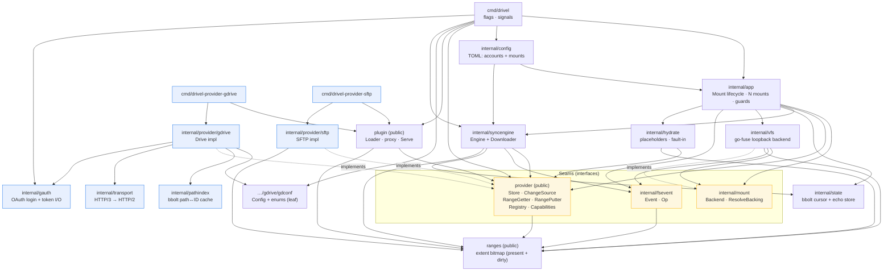

# Architecture diagrams

Two views of Drivel: the **runtime components** (what talks to what while a mount
is live) and the **code structure** (how the packages depend on each other).
These complement the prose in [DESIGN.md](../../DESIGN.md); the section numbers below
point back to it. For the *dynamic* view — the order things actually happen in a
push, a pull, a sweep or a hydration — see [Workflows](workflows.md).

## Component overview (runtime)

How data flows while a mount is running. The FUSE layer is on the hot path;
everything to the right of the event channel is off it.

Dotted edges are the M5 lazy-hydration path, active only under `-lazy`.

The `cloud` box is a **separate process** since M9 (DESIGN.md §2.10). Everything to
its left holds a `provider.Store` and does not know that; everything inside it is a
plain Go implementation of that interface and does not know it is being called over
a socket. Which of `drive` and `sftp` is behind the proxy — and which optional
capabilities it offers, so whether the downloader polls a feed at all — is settled
once, at launch.

Key points, mapped to DESIGN.md:

- **Reads and lookups never leave the box** — the FUSE backend proxies straight to
  the backing directory (§2.1–§2.2). Only *mutations* generate an
  `fsevent.Event`, pushed onto a buffered channel so the FUSE path never blocks
  on the network.
- **Outbound** (`Engine`, §5): debounce per path (`-push-delay`, bounded so a
  never-quiet path cannot be held indefinitely) → path-hashed worker pool →
  provider `Store` calls, with retry/backoff on retryable errors.
- **Inbound** (`Downloader`, §3): poll the provider's `changes.list` cursor feed,
  apply changes to the backing directory.
- **Echo suppression** (§4): both directions consult the `state` store so a change
  that originated locally isn't re-applied when it echoes back from Drive. This is
  the load-bearing correctness concern.
- **Transport** (§2.6) sits *below* OAuth: HTTP/3 preferred, HTTP/2 fallback.
- **Smarter uploads** (§9, M6 — always on): before a content push the engine skips
  the upload entirely if the local bytes hash to what was last synced, and sends
  only the changed extents when the provider can write byte ranges. Drive cannot,
  so it falls back to a whole-file (but chunked and resumable) upload. Every gate
  declines toward the slower, always-correct route: an event that cannot name
  every changed byte reports `nil` extents, meaning "push everything".
- **Lazy hydration** (§9, M5 — opt-in via `-lazy`): the downloader writes
  placeholders instead of content, the FUSE layer faults content in on the first
  read or partial write, and the uploader asks the hydrator before every push so a
  placeholder's zero bytes never overwrite the real remote file. That last edge is
  load-bearing, not an optimization.
- **Enumeration & reconcile** (§9, M7b — always on): the change feed only reports
  what changes after a cursor is taken, so the downloader sweeps the whole remote
  tree once (`provider.Enumerator`) before it starts tailing — on a first run, a
  resumed sweep, an expired cursor, or `-resync`. Since M7c the walk has two
  shapes — a scoped breadth-first descent from the mount root, or a flat listing
  of the whole account — and neither dominates; see
  [Workflows §4](workflows.md#scoped-versus-flat-enumeration-m7c). Two rules carry
  it whichever runs: the start token is taken *before* the sweep and adopted
  *after* it, and a deletion is
  inferred only from a baseline (the §4 echo records plus the sweep's own
  per-generation seen marks), never from a file being absent on one side. So the
  first-ever run deletes nothing.

## Code structure (package dependencies)

Compile-time dependency direction. Arrows point from a package to what it imports.
The seams (`mount.Backend`, `provider.Store`) are the interfaces that keep the
core provider- and FUSE-agnostic.

What the graph enforces:

- **The sync engine imports only the seams** — `provider`, `fsevent`, `state` —
  never a concrete Drive type. Swapping providers means writing a new
  `provider.Store`, not touching `syncengine`.
- **`gdrive` is the only package that knows about Drive**, and it is the only one
  that imports `transport` and `gauth`.
- **The blue boxes are not in the `drivel` binary.** Since M9 a backend is a
  separate executable (`cmd/drivel-provider-*`), so the Drive SDK, the QUIC
  transport, OAuth, the path index and the SSH stack are all linked into the
  plugin that needs them and into nothing else. `cmd/drivel` imports `plugin`,
  which knows how to launch one, and `gdconf`, which is the leaf holding the
  Drive settings table the `-drive-*` flags build — vocabulary without the SDK.
- **`provider`, `ranges` and `plugin` are public packages**, outside `internal/`,
  because an out-of-tree backend has to import all three: the interfaces it
  implements, the extent type `RangePutter` names, and the `Serve` its `main`
  calls.
- **`vfs` implements `mount.Backend`** and speaks `fsevent`, but knows nothing
  about providers or sync — a mutation just becomes an event.
- **`internal/app` is the composition root**, and `cmd/drivel` is only the flag
  layer above it. `app` is where a concrete backend, provider, engine and state
  store are wired together for one mount, and where N of them are supervised;
  `cmd/drivel` maps flags and config to specs and hands them over. `app` names a
  provider *kind*, never a type.
- **`hydrate` depends only on `provider`** and `ranges`, and its consumers reach it
  through small interfaces they declare themselves (`mount.Hydrator`,
  `syncengine.Placeholders`, `syncengine.Materializer`). So `vfs` still knows
  nothing about providers, and `syncengine` still knows nothing about xattrs.
- **`ranges` is a leaf** — pure value types, no I/O, imported by everything that
  talks about byte extents. It is deliberately not part of `hydrate`: dirty-range
  tracking (M6) runs in eager mode too, and the default path must not have to
  import the lazy-hydration package to describe a write.
