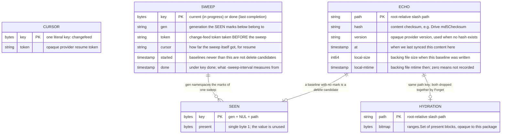
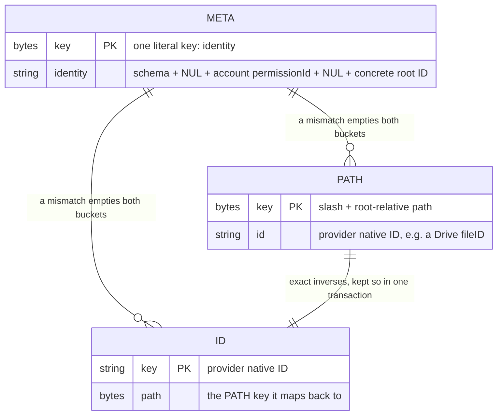
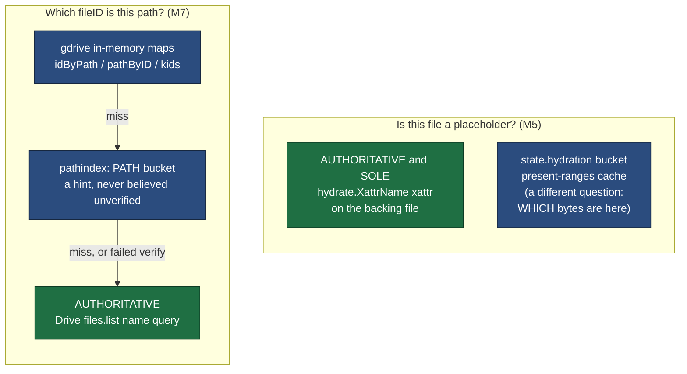

# Storage schema

Drivel keeps two embedded [bbolt](https://github.com/etcd-io/bbolt) databases.
They are two files on purpose, split along the provider seam (DESIGN.md §2.4,
§2.5): the engine-level one is provider-agnostic, and the other holds a single
provider's private path↔ID translation for a single account. Merging them would
put per-account, wipe-on-mismatch data inside the sync engine's reach.

Neither file is authoritative for anything. Losing either costs latency, API
quota and precision — never user data. The [authority ladder](#authority-ladder)
below is the reason.

Since M8 there is one pair of these files **per mount**, not per process: a
configured mount defaults its state DB to `$XDG_STATE_HOME/drivel/<name>/state.db`.
The schema below is unchanged — what changed is that sharing one between two
mounts is now a startup error rather than a slow surprise, because each engine
would read the other's echo records as its own baseline.

## `drivel-state.db` — engine sync state

Owned by `internal/state`. Written by the uploader, the downloader and the M7b
reconciler; bbolt serialises the writers and gives readers a snapshot, so there
is no extra locking.

What each bucket costs if the file is lost:

| bucket | role | loss |
| --- | --- | --- |
| `cursor` | where to resume the change feed | fresh token, then a full sweep |
| `echo` | §4 loop breaker **and** the M7b delete baseline | first-run semantics: deletes nothing, re-pushes |
| `hydration` | M5 present-ranges cache over the xattr marker | one stat |
| `sweep` | resume point of an interrupted enumeration, plus when the last one finished | the sweep restarts, and the next mount treats a periodic sweep as overdue |
| `seen` | which paths one sweep observed remotely | a resumed sweep would infer false deletes — which is why these are on disk and not in memory |

`local-size` / `local-mtime` fingerprint the **backing** file, not the remote one,
and they exist for providers that publish no content checksum — every filesystem
backend in the M17–M21 group, where `hash` is always empty. They are what M7b's
`matchesBaseline` uses to tell "unmodified since we last agreed with the remote"
from "edited locally", which is the question deciding whether a remote deletion is
applied here or the local file is kept and pushed back.

Size and mtime are weaker than a digest and sufficient for this one job, because
this is the *local* file: the kernel keeps its mtime to nanoseconds, so any write
moves it. The remote's own coarse mtime never enters into it.

**A zero `local-mtime` means "not recorded", never "matches".** That covers an
echo written before the fields existed, a directory, and a stat that failed.
Reading it as a match would delete a file somebody had edited. Before these fields
existed a hashless provider answered "no baseline to compare against" for every
file, so a deletion made on the remote was undone on the very next sweep — found
against a live OpenSSH server, not in a test.

The `echo` bucket is the one that grows: a baseline is dropped when the path is
gone on **both** sides, and only a sweep can establish that. Deletes seen while
running are pruned on the path that caused them — through the mount by
`Engine.forgetPath`, through the feed by the page-batched `flushForget`. What is
left over is offline activity and the failure tail, which the periodic sweep
(`-sweep-interval`, default 24h) exists to clear.

Do not prune it any other way. Pruning a baseline and inferring a delete are the
same decision from the same evidence: "absent locally" cannot distinguish *already
gone on both sides* from *deleted locally while we were down, remote still has
it*, and dropping the second loses a pending delete — the next sweep then finds a
remote file with no baseline and puts it back. TTL and LRU eviction fail the same
way, silently, since neither age nor recency says anything about whether the path
still exists.

## `drivel-index.db` — provider path↔ID index

Owned by `internal/pathindex`, composed privately by `gdrive`. Below the seam:
the sync engine never sees it and never learns what a native ID is.

Three properties that are load-bearing rather than incidental:

- **Keys carry a leading slash.** bbolt rejects a zero-length key and the mount
  root is the empty path. It also makes the subtree prefix uniform (`"/a/"`),
  and `/` sorts below every character a path component can start with, so a
  directory's children are one contiguous run — `Forget` and `Rename` are a seek
  plus a walk, not a full-bucket scan.
- **The two directions are written in one transaction**, evicting both stale
  halves (the ID this path used to name, the path this ID used to live at). A
  leftover reverse entry resolves a change-feed ID to a path it no longer
  occupies, and `Files.Update` on that destroys data with no conflict copy.
- **`meta.identity` binds the file to one account and one root.** Binding is
  lazy — at first index use, not at open — because mount must not require the
  network. Unbound reads empty and drops writes.

## Authority ladder

Everything in both databases is derived. This is what the sync engine actually
trusts, cheapest source first, with only the bottom row authoritative:

The M5 ladder has one rung, and that is the correction M10 made rather than a
simplification of the diagram. `Hydrator.IsPlaceholder` reads the marker and
nothing else: the hydration bucket caches *present ranges*, which answers "which
bytes are here", and no code path has ever consulted it to answer "is this a
placeholder". So there is no fallback — a backing filesystem that cannot store the
attribute has no placeholder record at all, immediately, and `-lazy` is unsafe
there rather than merely fragile. The attribute's spelling is per platform
(`user.drivel.placeholder` on Linux and macOS, `drivel.placeholder` in
`EXTATTR_NAMESPACE_USER` on FreeBSD), so callers use `hydrate.XattrName`.

The M7 rule is the one that is easy to erode: a persisted entry is a hint about
the past. The process that wrote it may have exited months ago, and the remote
is free to have moved, renamed, replaced or trashed that object since — the ID
still resolves, just to the wrong file. `verifyLocked` re-checks name, parent and
not-trashed before an entry is believed, and a failed directory drops its whole
subtree. That check is the price of persistence, not an optimisation to remove.
