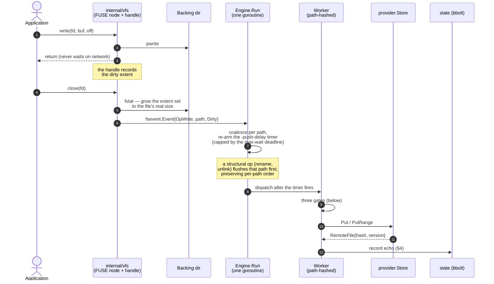
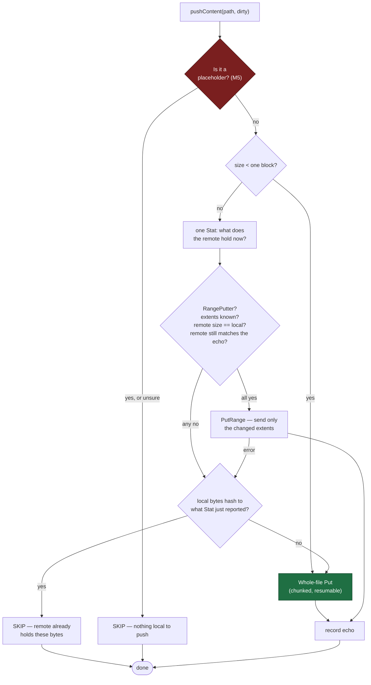
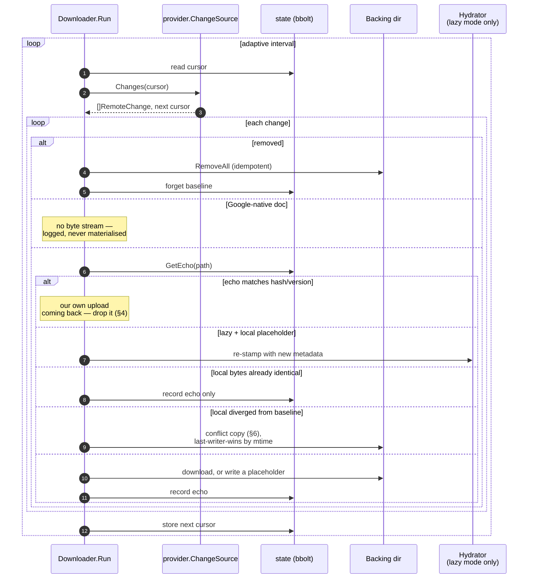
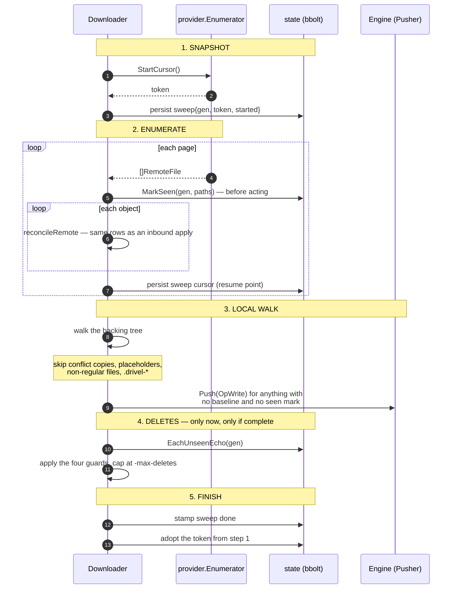
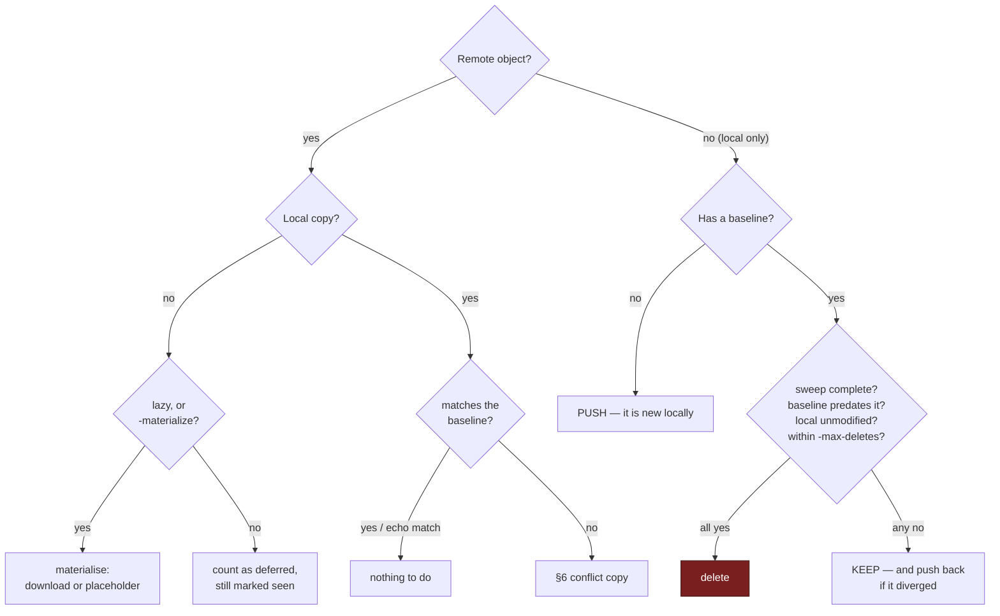
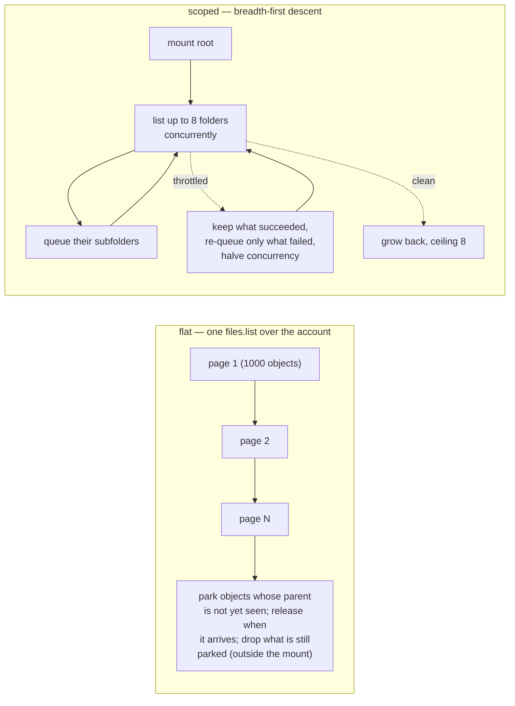
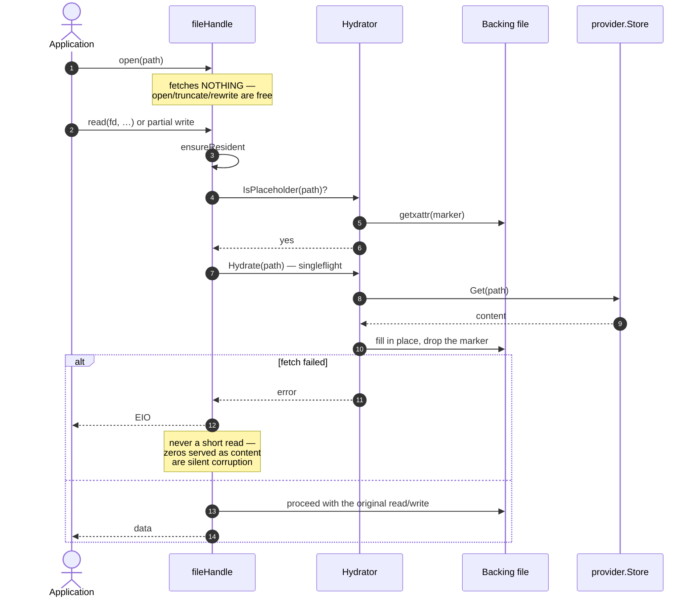
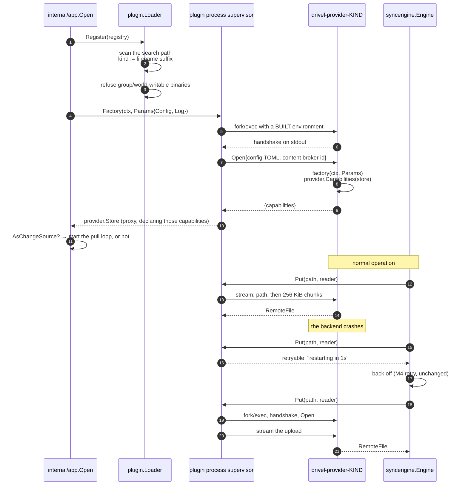
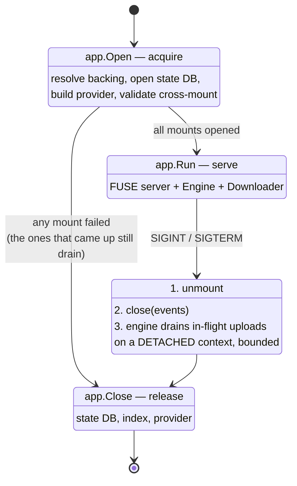

# Workflows

How Drivel actually runs, in the order things happen. [Architecture](architecture.md)
is the static view — what talks to what; this is the dynamic one. Section numbers
point into `DESIGN.md` for the reasoning.

## 1. Outbound: a write becomes an upload

Nothing on this path blocks the FUSE reply. The mount's only obligation is to put
an event on a buffered channel.

Three details that look incidental and are not:

- **`Release` fstats the backing file before the wrapped handle closes.** A handle
  only sees its own writes, so its idea of the file's length stops at the last
  byte it wrote. Without the fstat the engine's size cross-check rejects every
  extent set and range writes silently never fire.
- **Workers are chosen by path hash**, so all operations on one path are ordered
  with respect to each other, while unrelated paths proceed in parallel.
- **The `OpWrite` arrives on `close`, not on each `write(2)`** — note where the
  arrow leaves the diagram. That is why `-push-delay` defaults to a value as short
  as 300ms: it is merging an `OpCreate` with one `OpWrite`, not batching a
  transfer, and a 50 GB copy passes through it as two events. It also means a file
  held open and never closed produces *no* event at all, at any setting, and is
  reached only by the sweep. Because each later event re-arms the timer, the
  window alone cannot bound how long a path waits; the max-wait deadline, counted
  from the change that made the path pending, is what stops a never-quiet path
  from being held until shutdown.

## 2. The three gates before a content push

Every content upload runs this. Anything that does not clear a gate falls through
to the whole-file `Put` that M1–M5 always did — **that fallback is never wrong,
only slower**, which is what makes the whole optimisation safe.

Why it is in this order:

- **The placeholder gate is first and nothing may get in front of it.** A
  placeholder holds zero bytes at full apparent size; uploading one replaces the
  remote file with nothing. It fails *safe* — unsure means "placeholder" means
  skip. Do not replace it with a size heuristic: a legitimate truncate-to-zero
  looks identical and must still sync.
- **The range gate runs before the hash gate** because hashing reads the whole
  file. Checking "did anything change?" first would spend a 4 GB read to avoid a
  4 MiB upload.
- **The range gate requires the remote to still match the echo record.** A
  whole-file `Put` over someone else's edit loses it per documented §6 policy —
  bad, but recoverable, and the loser's bytes existed as a coherent version.
  Splicing extents into a *diverged* remote makes a hybrid file that existed
  nowhere, with no conflict copy. Diverged, no echo, or no state store ⇒ decline.
- **The hash gate compares against what `Stat` says the remote holds now**, not
  against the echo. A stale echo would otherwise skip the push forever and never
  restore the file.
- **Both gates share one `Stat` and are skipped below one block**, where the
  round-trip costs about what the upload would.

Drive implements no `RangePutter` — `files.update` replaces content wholesale —
and that is deliberate, not a gap. What Drive gets from this is the hash gate plus
chunked resumable sessions.

## 3. Inbound: a remote change becomes a local file

**Echo suppression (§4) is the load-bearing correctness concern in this
codebase.** Without it every upload comes back through the feed as a remote change
and is re-applied, which at best wastes a round trip and at worst overwrites a
newer local edit. Both directions consult the same store.

Note the two distinct "nothing to do" outcomes: an *echo match* (this is our own
content) and *identical local bytes* (common on a first sync over a directory that
already mirrors Drive). They are reached by different evidence and both matter.

## 4. The enumeration sweep and reconcile

The change feed only reports what changed *after* a cursor was taken, so a Drive
that existed before the first mount is invisible to it. A sweep is what makes the
tree present. It runs off the FUSE path, on a first run, a resumed sweep, a dead
cursor, an elapsed `-sweep-interval`, or `-resync`.

**Snapshot, then tail.** The start token is taken *before* the sweep and adopted
only *after* it. The overlap replays changes that are idempotent and that echo
suppression drops; the other order loses everything that changed during the sweep,
permanently and silently.

### The three-way decision

**A delete is inferred only from a baseline, never from absence alone.** The
baseline is the echo store ("we have synced this content at this path"); the
per-generation `seen` marks answer "did this sweep observe it?". No baseline means
the path is *new*, whichever side it is on — which is why **the first-ever run
deletes nothing**.

The four guards on the delete rows are each load-bearing:

1. Deletes run only after a **complete** sweep.
2. The baseline must **predate** the sweep, or a file created locally *during* it
   looks remotely deleted.
3. A local copy that **diverged** from its baseline is kept and pushed back.
4. `-max-deletes` **abandons the whole pass** rather than trimming it — a huge
   count means the premise is broken, not that there are 4000 real deletions. A
   refused pass still counts as *completed*, so recovery is `-resync` **and** a
   higher cap.

Three implementation notes. The marks are **persistent**, because an in-memory
seen-set would report every page a *previous* process consumed as remotely
deleted. The completion stamp is persistent for a different reason: the periodic
schedule measures from it, so someone who mounts for an hour a day still reaches
an interval. And **the sweep is the only correct place to prune a baseline**,
because pruning one and inferring a delete are the same decision from the same
evidence — TTL and LRU eviction both fail here, silently.

### Scoped versus flat enumeration (M7c)

Drive has no recursive "everything under this folder" query, so the two strategies
are genuinely different shapes, and neither dominates.

`flat` costs ~1 request per 1000 **account** objects; `scoped` costs ~1 request per
**folder in the mounted subtree**. So a folder-dense subtree is cheaper flat, and
`auto` picks by whether `-drive-root` names a concrete folder.

Two things about the scoped path are not optional. **Under throttling it keeps the
listings that succeeded and re-queues only the ones that failed** — putting a
throttled batch back whole measured 97× the ideal request count at a 20% refusal
rate, because at fanout 8 most batches are spoiled and re-issuing all eight feeds
the throttle. And **the fan-out is a ceiling, not a rate**: it halves on a
throttled listing and grows back on a clean one, floor 1.

The parking machinery belongs to the **flat path alone** — the descent is
parent-first by construction. Do not unify them. Resume also stops mattering in
scoped mode: the frontier is in memory, and a cursor arriving without one simply
restarts a descent that is cheap by construction.

## 5. Lazy hydration: fault-in on first I/O

**Hydrate on first I/O, not on `Open`.** FUSE delivers `O_TRUNC` as a separate
`Setattr` unless `atomic_o_trunc` is negotiated, so `Open` handles only the atomic
case (dropping the mark) and `Setattr` handles truncation. The consequence is that
opening a file to overwrite it never downloads the content it is about to discard.

**The xattr is authoritative and there is no fallback.** `IsPlaceholder` reads the
marker and only the marker — the state DB caches present *ranges*, which answers a
different question. No marker means no placeholder record at all, immediately,
which is why `-lazy` is unsafe on a backing filesystem without user extended
attributes rather than merely fragile.

Conflict copies are always downloaded **in full**, because their paths exist only
locally and could never be hydrated later.

## 6. Launching a backend, and surviving one that dies

A backend is a separate process (M9, DESIGN.md §2.10). This is what a mount does
to get one, and what happens when it goes away underneath.

Three things this picture is making a point of:

- **The capability answer is taken once**, at step 9, and held for the life of the
  mount — including across a restart. The engine decides at step 11 whether this
  mount has a pull loop at all, so an answer that changed underneath it would
  leave a downloader polling a feed that is gone.
- **A crash is a retryable error, not a failed push.** There is no supervisor
  goroutine; the engine's existing backoff is what waits, and the next call is
  what relaunches. The relaunch is rate-limited, and a process that lived at least
  a minute does not inherit a crash loop's delay.
- **The environment at step 5 is built, not inherited.** See `plugin/env.go` — the
  point is that a backend authenticates with what its configuration names, so
  which account a mount uses is a property of the config file rather than of the
  shell that started it.

## 7. Mount lifecycle

The three-phase split is what lets a process that fails to bring up mount 3 of 5
unmount and drain the two that came up. Inside `Run` the per-mount ordering is
load-bearing: **unmount → close the event channel → wait for the bounded drain**,
with the engine on a **detached context** so that the Ctrl-C which stopped the
mount does not also abort the uploads it is trying to finish. `App` aggregates
around that; it must never collapse it into one cancellation.

## Where to look next

- The path→ID resolution ladder and both database layouts: [schema](schema.md).
- Why each of these rules exists, at length: `DESIGN.md` §2–§7 and §9.
- The words used here without definition: [glossary](glossary.md).
